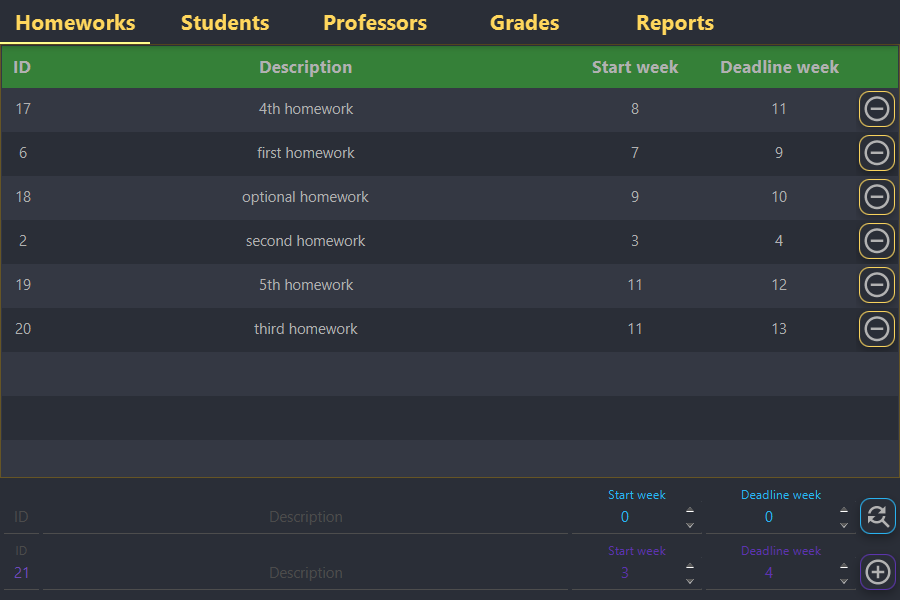
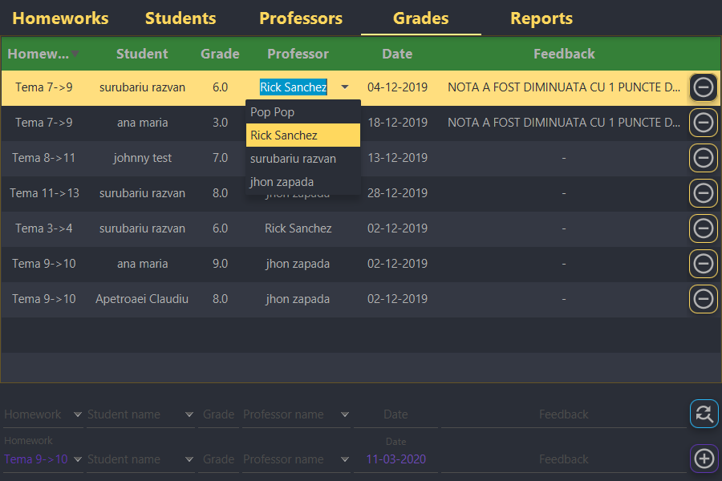
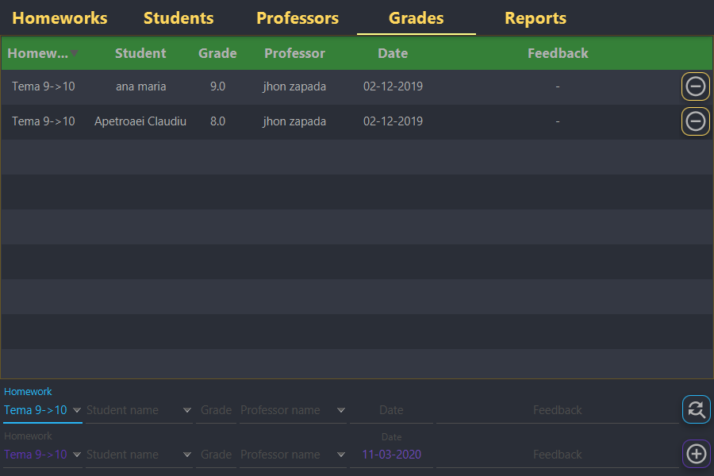

# GradingApp

An app that gives teachers the option to give grades to students and generate reports based on the given grades.

The app has 3 clerance levels:
  <ul>
    <li>
      student:
      <ul>
        <li>can see the homeworks</li>
        <li>can see only his/hers grades</li>
        <li>can see the teachers</li>
      </ul>
    </li>
    <li>
      professor:
      <ul>
          <li>can see and add/remove homeworks</li>
          <li>can see and add/remove grades</li>
          <li>can see the teachers</li>
          <li>can generate reports</li>
      </ul>
    </li>
    <li>
      admin:
        <ul>
          <li>can see and add/remove homeworks</li>
          <li>can see and add/remove grades</li>
          <li>can see and add/remove teachers</li>
          <li>can generate reports</li>
        </ul>
      </li>
  </ul>

