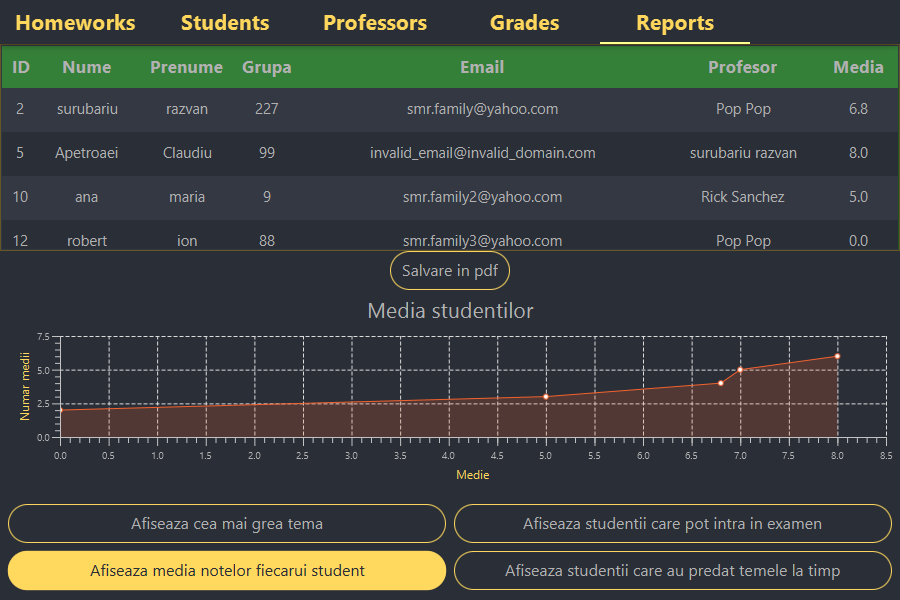

# GradingApp

The app has 3 clerance levels:
  <ul>
    <li>student:</li>
    <li>
      <ul>
        <li>can see only his/hers grades</li>
        <li>can see the teachers and the homeworks</li>
    <li>professor:
      can see all
    </li>
    </li>
  </ul>
An app that gives teachers the option to give grades to students and to generate reports based on the given grades.

